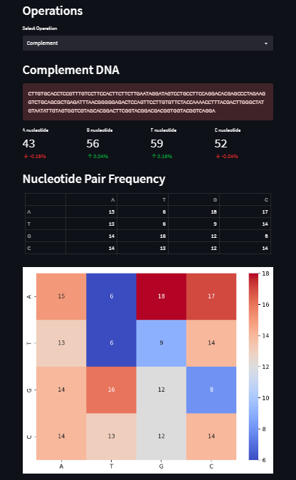

# DNA Nucleotide Analysis Web App

This web application enables users to analyze DNA sequences through various operations such as counting nucleotides, calculating GC content, transcribing DNA to RNA, translating RNA to protein, and analyzing amino acid frequencies. It also provides interactive visualizations for enhanced understanding.

# Screenshots




## How to Use:

### Clone the Repository:

1. Open your terminal or command prompt.
2. Navigate to the directory where you want to clone the repository.
3. Run the following command:

```bash
git clone https://github.com/Astrasv/Bioinformatics-DNA-Analyser.git
```

### Install Dependencies:

1. Navigate to the cloned repository directory.
2. Create a virtual environment (optional but recommended).
3. Install the required dependencies by running:

```bash
pip install -r requirements.txt
```

### Run the Application:

1. After installing the dependencies, run the following command:

```bash
streamlit run dna.py
```

2. The application will start running locally.
3. Open your web browser and go to `http://localhost:8501` to access the web app.

## Features:

- **DNA Analysis**: Analyze DNA sequences, count nucleotides, and calculate GC content.
- **Operations**: Complement DNA, reverse sequences, and get reverse complements.
- **Pair Frequency**: View nucleotide pair frequency using interactive heatmaps and tabular representations.
- **RNA Transcription**: Transcribe DNA sequences into RNA.
- **Protein Analysis**: Translate RNA sequences into proteins and analyze amino acid frequencies.

## About the Developer:

This web app is developed by Sudharsan Vanamali. It's built using Streamlit, a powerful tool for creating data apps with Python.
If you have any feedback or suggestions, feel free to reach out!

**Sudharsan Vanamali**

## Technologies Used:

- **Python**: The backend of this web app is written in Python.
- **Streamlit**: Streamlit facilitates the interactive user interface.
- **Pandas**: Pandas aids in data manipulation and analysis.
- **Matplotlib and Seaborn**: These libraries enhance data visualization.
- **Altair**: Altair creates interactive visualizations.
- **PIL (Python Imaging Library)**: PIL assists with image handling.

## Additional Resources:

- [Streamlit Documentation](https://docs.streamlit.io/)
- [Pandas Documentation](https://pandas.pydata.org/docs/)
- [Matplotlib Documentation](https://matplotlib.org/stable/contents.html)
- [Seaborn Documentation](https://seaborn.pydata.org/)
- [Altair Documentation](https://altair-viz.github.io/)

## Get in Touch:

If you have any questions, suggestions, or feedback, feel free to reach out:
- Email: astrasv247@gmail.com
- GitHub: [Your GitHub Profile](https://github.com/Astrasv)
